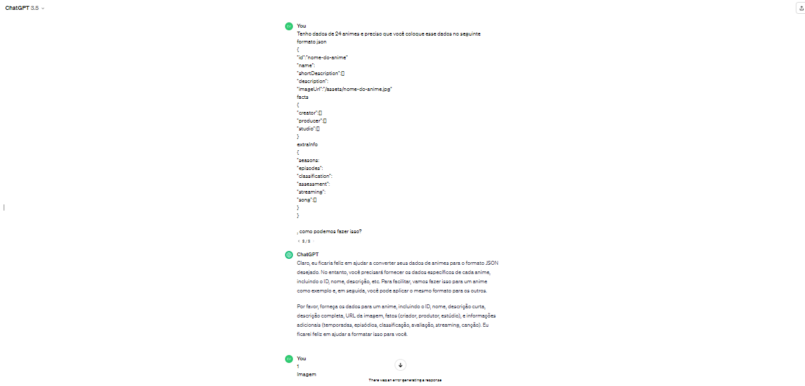
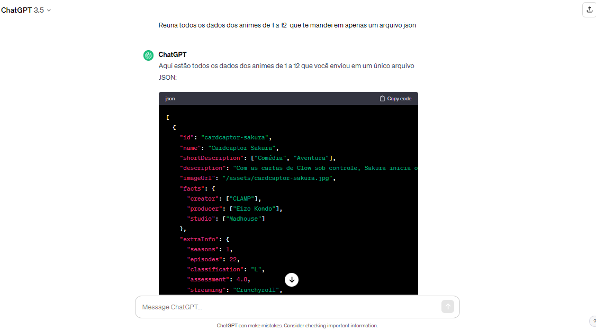
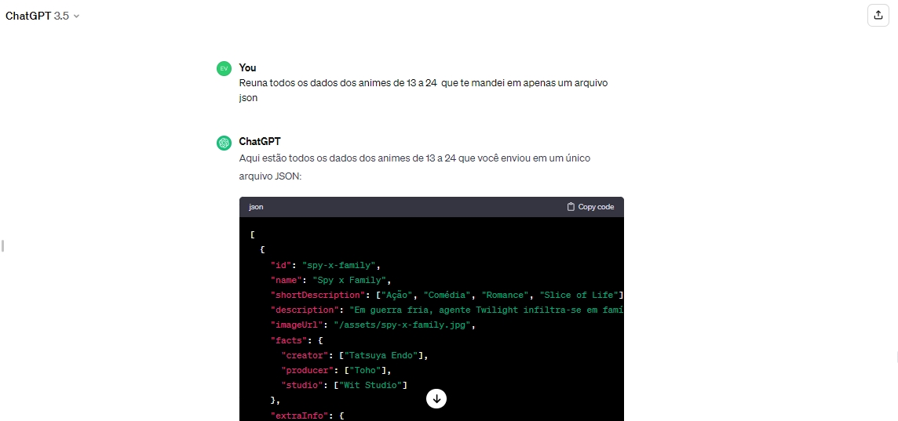
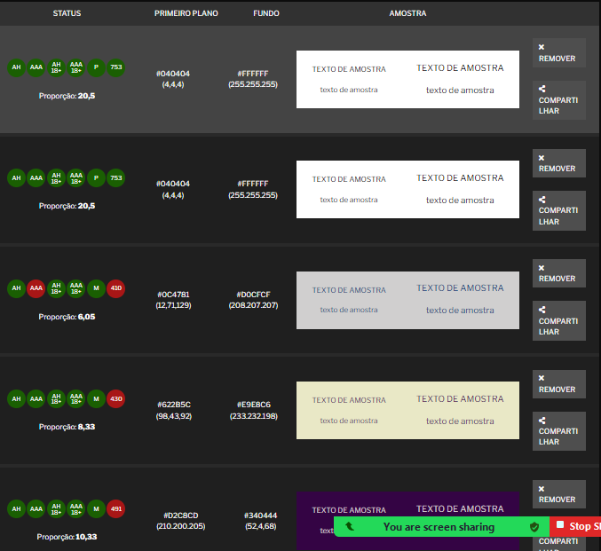

# Dataverse-Otakus´s list

## Índice

* [1. Resumo do projeto](#1-resumo-do-projeto)
* [2.Considerações gerais](#2-considerações-gerais)
* [3. Funcionalidades](#3-funcionalidades)
* [4. Considerações técnicas](#4-considerações-técnicas)
* [5. Critérios de aceitação mínimos do projeto](#5-critérios-de-aceitação-mínimos-do-projeto)
* [6. Objetivos de aprendizagem](#6-objetivos-de-aprendizagem)
* [7. Testes](#7-testes)
* [8. Conteúdo de Referência](#8-conteúdo-de-referência)
* [9. Status do projeto](#status-do-projeto)
* [10. Desenvolvido](#desenvolvido)
***


## 1. Resumo do projeto

Neste projeto, foi **construido um _site_ para visualizar um
_conjunto de dados_** que foi gerado através do [prompting](https://chat.openai.com/share/fcb50355-1a5e-4b1c-8877-dca5a272149d).
.
.
.

Neste projeto utilizamos IA(ChatGpt, Copilot e Bard) para gerar nosso conjunto de dados, com isso aprendemos também técnicas de prompting.
Este site foi adaptado para atender as necessidades que descobrimos dos nosso usuários.
Após conclusão, temos um site que permite ao usuário visualizar, filtrar, ordenar e calcular determinadas estatísticas dos dados.

## 2. Considerações gerais

Projeto realizado em dupla.
Conclusão do projeto em 6 sprints.
A Geração de dados foi concluída em 1sprint, assim como as historias de usuário e protótipo.
O projeto esta implantado no gitHub Pages.


## 3. Funcionalidades

A aplicação permite que o usuário visualize os cartões em tela. Nos cartões constam os dados que usuário tem interesse em ver primeiro, e um botão com curiosidades.
A aplicação permite que o usuário filtre por streaming e ordene os dados por nome de a-z e z-a.
A aplicação calcula e exibe ao usuário as estatísticas das classificações indicativas em porcentagem.
A aplicação conta com um botão de limpar os dados filtrados e ordenados.
Quando o usuário filtra e ordena a pagina não recarrega.
A aplicação é responsiva.
Foram criados um prototipo de media fidelidade para o design mobile e para design desktop
.png).


## 4. Considerações Técnicas

Toda a logica do projeto foi implementada em JavaScript, HTML e CSS.
Usamos boilerplate original disponibilizado, só incliuimos mais uma pasta dentro de SRC.

```text
.
├── README.md
├── package.json
├── src
|  |──assets
|  |   └──dados
|  |   └──prototipo
|  |   └──imagens
|  ├── data 
|  |  └── dataset.js (Dados gerados com a IA)
|  ├── dataFunctions.js
|  ├── view.js
|  ├── index.html
|  ├── main.js
|  └── style.css
└── test
   └── data.js
   └── dataFunctions.spec.js
   └── tests-read-only
```

Index.html: colocamos toda a estrutura da nossa pagina.
Main.js: colocamos toda a manipulação de DOM.
DataFunction.js: colocamos todas nossas funções, com javaScript puro.
dataset.js: colocamos os dados gerados.
view.js: colocamos todo o conteudo que precisa ser renderizado.
dataFunctions.spec.js: criamos os testes unitários das funções.
data.js: criamos o mock para usar os dados.
A estrutura ficou clara e organizada para a dupla, facilitando o nosso entendidimento.

## 5. Critérios de aceitação mínimos do projeto

Seguimos as recomendações do Readme da Lab:
Uso de HTML semântico.
Uso de seletores CSS.
Uso de seletores do DOM.
Manuseio de eventos do DOM.
Manipulação dinâmica do DOM
Variáveis (declaração, atribuição, escopo).
Uso de condicionais (if-else, switch, operador ternário, lógica booleana).
Uso de loops (while, for, for..of).
Funções (parâmetros, argumentos, retorno)
Arrays (arrays)
Objetos
Módulos ECMAScript (ES Modules)

### Critérios do Projeto
Definimos nosso produto, e estamos documentando pelo Readme.
Criamos as histórias de usários com definição de pronto e critérios de aceitação.
Geramos os dados conforme a estrutura do objeto pedida pela Lab, usamos o ChatGPT com prompt.
Design de Interface de Usuário criamos um protótipo de média fidelidade usando o Figma, solicitamos testes de usabilidade para diferentes usuários. Foi neccesário adaptar nosso protótipo por questões de acessibilidade.
(prints do teste)
.
 [teste de contraste](https://trello.com/1/cards/659846fe5a6556bae6296b7e/attachments/65a0614f59955a0310c1c3a1/download/testecontraste)

### Implementação da Interface de Usuário (HTML/CSS/JS)
Nosso projeto não seguiu totalmente a interface que projetamos, consideramos o tempo que tinhamos. Contudo foi centrado no usuário, colocamos o usuário no centro e consideramos o que seria importante na visão dele.
O estrutura deste projeto não tinha Testes Unitários, então foi necessário escrever para testar as funções de filtrar e ordenar os dados, bem como calcular estatísticas.

## 6. Objetivo de aprendizagem

Conseguimos alcançar pelo menos incialmente os critérios de aprendizagem
HTML, CSS e JavaScript
Web APis
Controle de Versões(Git e GitHub)
Centrado no usuário
Design de produto
Pesquisa
AI prompting

## 7. Testes

npm run test:oas-html
npm run test:oas-css
npm run test:oas-web-api
npm run test:oas-js
npm run test:oas-prompting
npm run test:e2e
npm run test

## 8. Conteúdo de Referência

[Geração de dados](https://recursivos.com/html/microdatos/)
[Histórias de usuário](https://cwi.com.br/blog/como-escrever-boas-historias-de-usuarios/)
[Testes](https://gabrieluizramos.com.br/anatomia-de-um-teste-em-javascript)

## 9. Status do projeto

Projeto Finalizado

## 10. Desenvolvido

Projeto desenvolvido por: Evelyn Oliveira  e Flaviane Lima


